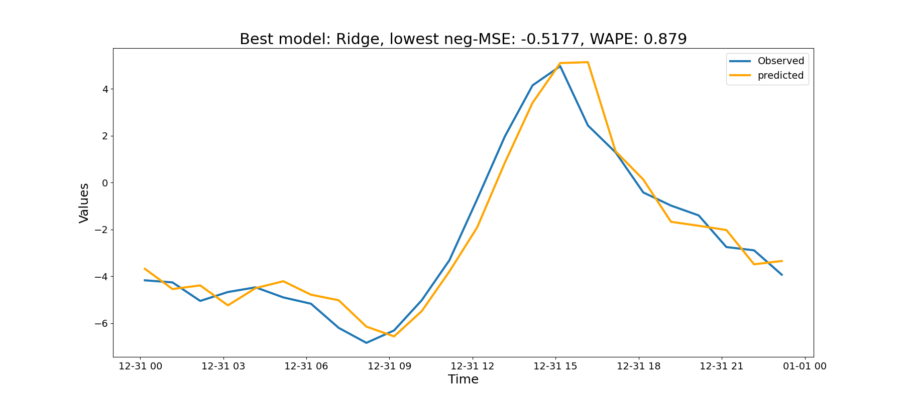

# Forecast

#### To optimize hyperparams and compare models, using [optuna](https://optuna.readthedocs.io/en/stable/) package.


#### Just clone that repo, install packages from _requirements.txt_ and run:

```bash
python forecast/demo.py
``` 

#### Alternatively, after cloning:

```bash
python -m pip install .
demo
```

#### Example output




### TODO:
* Compute weekly avg, monthly avg in ts constructor
* Detect datetime granularity, so not all avg are allowed, nor all sin/cos transformation
* Wrap models so lags becomes a par to optimize
* Use TimeSeries split for CV strategy: done
* Use wape (or other metrics) as the value to maximize: done
